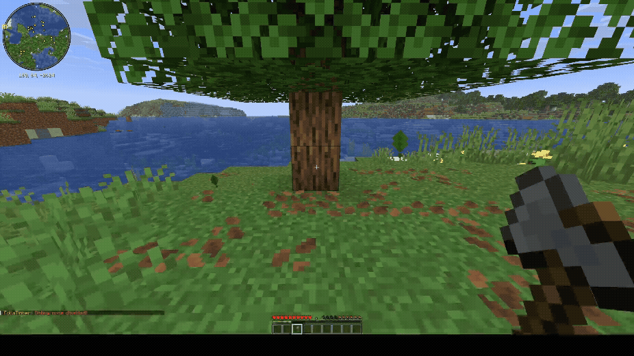
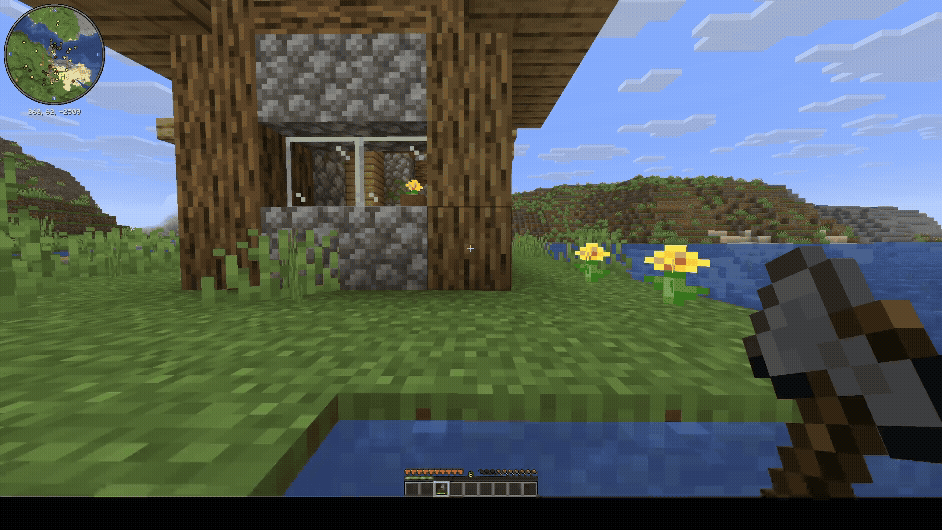

# FoliaTimber 🪓

  

  <strong>Smart tree chopping with intelligent structure protection for Folia & Paper</strong>

  
  
  
  

---

**Finally, a tree feller that doesn't break your house.**

FoliaTimber is a lightweight, high-performance plugin built for **Folia** and **Paper** 1.21+. It lets you chop down entire trees by breaking just one log, but with a smart twist: it knows when you're hitting a tree and when you're hitting a building.

---

## 📽️ See it in action

### Instant Chopping

*A simple oak tree falling with one hit. Clean and efficient.*

### Intelligent Structure Protection

*With debug mode on, you can see how the plugin ignores villager houses and player builds. Your treehouse is safe!*

---

## 🛠️ Why FoliaTimber?

Most "Timber" plugins haven't been updated for the multithreaded madness of **Folia**. This one was built for it from the ground up, using region-aware scheduling to keep your TPS steady.

- **Safe Builds:** Automatically detects ladders, planks, and signs on trees. If it looks like a structure, it won't be chopped.
- **Auto-Inventory:** Drops go straight to you. No more chasing logs down a hill or lagging out the server with hundreds of items.
- **Smart Tools:** Your axe only takes durability for the logs that actually break.
- **Multi-lingual:** Supports English, Turkish, and German.
- **Debug on the fly:** Use `/timber debug` to see exactly why a block was ignored or why a tree was chopped.

---

## 🎮 Commands

| Command | What it does | Permission |
|:---|:---|:---|
| `/timber` | Turn the feature on/off for yourself | `foliatimber.use` |
| `/timber debug` | See real-time detection info | `foliatimber.use` |
| `/timber lang` | Switch between `en`, `tr`, and `de` | `foliatimber.use` |
| `/timber reload` | Reload the config file | `foliatimber.reload` |

---

## 🔧 Installation & Requirements

1. Drop the JAR into your `plugins` folder.
2. Restart the server.
3. (Optional) Install **CoreProtect** and **WorldGuard** for even better protection.

- **Server:** Folia 1.21+ or Paper 1.21+
- **Java:** 21

---

## 📜 License

MIT License - Feel free to use and modify it!

---
*Created by **can61cebi***
